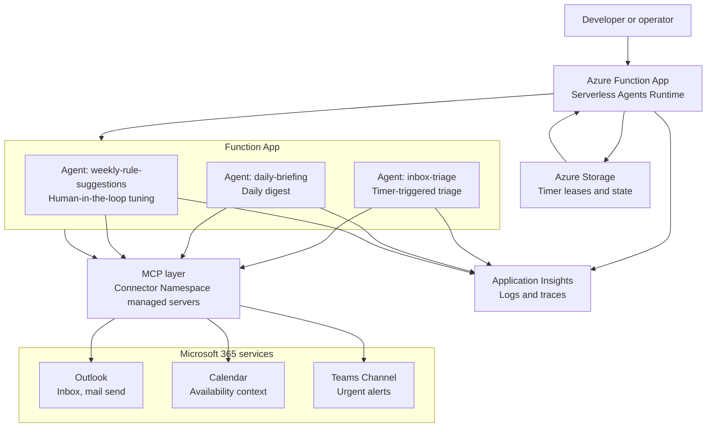

# M365 Inbox Agent — Serverless Agents (Markdown-only)

🔗 [Python (with custom tools) →](https://github.com/Azure-Samples/m365-inbox-agent-functions-python)

An opinionated inbox-triage sample for the **Azure Functions Serverless Agents Runtime (preview)**. Three timer-triggered agents read a Microsoft 365 inbox, decide what matters, send thoughtful replies, post urgent alerts to Teams, and suggest rule changes for a human to approve.

This markdown-only variant relies on managed MCP servers for Outlook and Teams through Connector Namespace. The `sample-data/` fixtures are kept as documentation and shape references for what the agents see in production through the Outlook MCP connection.

> 📝 Want offline dev with custom Python tools? See the [Python sibling](https://github.com/Azure-Samples/m365-inbox-agent-functions-python). Full comparison at [the bottom](#-markdown-variant-vs-python-variant).

##  Architecture



##  How the building blocks work

| Block | MCP action | Skill | Agent |
|---|---|---|---|
| Trigger on inbox | (timer in agent frontmatter) | `inbox-poll.md` | inbox-triage |
| Read inbox | `outlook.list_messages` | `inbox-read.md` | all 3 |
| Send email | `outlook.send_mail` / `reply_mail` | `email-reply.md` | all 3 |
| Post to Teams | `teams.post_channel_message` | `teams-post.md` | inbox-triage, daily-briefing |

Managed connector action names may vary slightly as the Outlook and Teams MCP servers evolve. Use the action names published by the connected MCP server when they differ from the examples above.

##  Prerequisites

- [uv](https://docs.astral.sh/uv/) (recommend Python 3.13+)
- [Azure Functions Core Tools](https://learn.microsoft.com/en-us/azure/azure-functions/functions-run-local)
- [Azure Developer CLI (`azd`)](https://learn.microsoft.com/en-us/azure/developer/azure-developer-cli/) for Azure deployment
- Azurite or another `AzureWebJobsStorage` value for timer triggers
- For production: an Azure subscription, a Microsoft Foundry project/model deployment, and permission to authorize Microsoft 365 connectors

##  Quickstart

This markdown-only variant requires a deployed Connector Namespace plus authorized Outlook and Teams MCP connections. There is **no local file fallback by design**; the sample proves the declarative MCP path. To experiment locally without Azure, use the [Python sibling](https://github.com/Azure-Samples/m365-inbox-agent-functions-python), which adds offline tool fallbacks.

1. Install dependencies from `requirements.txt`:

   ```bash
   uv sync
   ```

2. Deploy the Function App and managed MCP connectors:

   ```bash
   azd auth login
   azd env set TO_EMAIL recipient@example.com
   azd up
   ```

3. Authorize the Outlook and Teams connectors using the Connector Namespace portal URL from the deployment outputs.

4. Start the host locally with deployed settings, or rely on the cloud timer:

   ```bash
   cp local.settings.json.example local.settings.json
   uv run func start
   ```

5. Trigger immediately from terminal 2 instead of waiting for the timer:

   ```bash
   uv run python chat.py   # then pick 1 for inbox-triage
   ```

Success means real Microsoft 365 side effects: an Outlook reply or a Teams channel post. Keep the `func start` terminal visible for local logs, and use Application Insights `traces` for deployed runs.

##  Source Code

```text
README.md                         This guide.
chat.py                           Friendly local client for manually triggering timer agents.
.env.example                      Environment variable reference for local and deployed runs.
sample-data/inbox.json            Graph-shaped inbox fixture used as an Outlook MCP shape reference.
sample-data/inbox/*.json          Individual mock inbox messages for scenarios and tests.
function_app.py                   Minimal Functions entry point that loads the agents runtime.
inbox-triage.agent.md             Timer agent that classifies inbox items and takes action.
daily-briefing.agent.md           Timer agent that summarizes inbox and calendar priorities.
weekly-rule-suggestions.agent.md  Timer agent that proposes rule updates for human review.
agents.config.yaml                Default model and runtime configuration.
mcp.json                          Outlook and Teams MCP server configuration.
skills/vip-rules.md               Editable triage policy used by the agents.
skills/*.md                       Reusable markdown skills that describe MCP usage patterns.
infra/                            Azure resources created by azd.
```

##  Deploy to Azure

1. Sign in:

   ```bash
   azd auth login
   ```

2. Set the mailbox recipient used by deployment outputs and sample actions:

   ```bash
   azd env set TO_EMAIL recipient@example.com
   ```

3. Deploy:

   ```bash
   azd up
   ```

4. After deployment, review outputs:

   ```bash
   azd env get-values
   ```

##  What Gets Deployed

- Azure Functions app on a serverless hosting plan
- Azure Storage for host state, timer leases, and runtime state
- Application Insights for traces and action logs
- Microsoft Foundry account/project connection and model deployment configuration
- Connector Namespace resources for Outlook and Teams MCP managed servers
- Managed identity and RBAC assignments needed by the Function App
- App settings for `TO_EMAIL`, MCP endpoints, Teams target IDs, and Foundry model settings

##  Authorize Connectors

Connector resources are deployed before they can access your mailbox or Teams channel. Complete this one-time step after `azd up`:

1. Open the Connector Namespace portal URL printed by deployment outputs, or build it from the deployed connector gateway name.
2. Authorize the Office 365 Outlook connection with the account whose inbox the sample should triage.
3. Authorize the Teams connection and confirm `TEAMS_TEAM_ID` and `TEAMS_CHANNEL_ID` point to the intended channel.
4. Restart or rerun the agents after authorization. Until this is complete, MCP calls fail with authorization errors.

Use the Connector Namespace portal URL for authorization, not just the generic Azure resource overview page.

##  Scenarios

###  1. VIP urgent mail posts to Teams

**Goal:** verify the agent recognizes VIP urgency and posts to the authorized Teams channel.

**Setup:** send or keep a similar unread message in the connected Outlook inbox. `sample-data/inbox/01-vip-urgent.json` shows the expected shape.

<details><summary>What's in the message</summary>

```json
{
  "subject": "URGENT: Customer renewal blocker needs decision today",
  "from": { "emailAddress": { "name": "Morgan Lee", "address": "vip-name@example.com" } },
  "body": { "content": "...blocked on the discount approval. We need a decision today..." }
}
```

</details>

**Run:**

```bash
uv run python chat.py   # then pick 1
```

**What you should see (deployed / connectors authorized):**
- A real message appears in the configured Teams channel within about one minute.
- The `func start` terminal or Application Insights `traces` shows a VIP classification and Teams channel-post MCP call.

###  2. Incident alert becomes a briefing item

**Goal:** verify a P1 incident is escalated to Teams and summarized in the daily briefing.

**Setup:** send or keep a similar unread incident message in Outlook. `sample-data/inbox/03-incident-alert.json` shows the expected shape.

<details><summary>What's in the message</summary>

```json
{
  "subject": "P1 IcM: Checkout API elevated failures",
  "from": { "emailAddress": { "name": "Incident Bot", "address": "incident.bot@contoso.example" } },
  "body": { "content": "Severity: P1... Product: Checkout API... Impact: 18%..." }
}
```

</details>

**Run:**

```bash
uv run python chat.py   # pick 1 for triage, then pick 2 for daily-briefing
```

**What you should see (deployed / connectors authorized):**
- A Teams alert appears for the P1 incident.
- The `TO_EMAIL` mailbox receives a briefing with severity, product, impact, and owner ask.
- Application Insights `traces` shows the incident decision and briefing send.

###  3. Action-required mail gets a thoughtful reply

**Goal:** verify the agent recognizes a response deadline and sends or drafts a grounded Outlook reply.

**Setup:** send or keep a similar unread action-required message in Outlook. `sample-data/inbox/05-action-required.json` shows the expected shape.

<details><summary>What's in the message</summary>

```json
{
  "subject": "Action required: Review launch FAQ by Friday",
  "from": { "emailAddress": { "name": "Priya Patel", "address": "priya.patel@contoso.example" } },
  "body": { "content": "Could you review the launch FAQ by Friday..." }
}
```

</details>

**Run:**

```bash
uv run python chat.py   # then pick 1
```

**What you should see (deployed / connectors authorized):**
- Outlook sends or drafts a concise reply that acknowledges Friday and lists next steps.
- The `func start` terminal or Application Insights `traces` shows the reply decision and Outlook MCP action.

##  Customizing Rules

Edit `skills/vip-rules.md` to change who counts as a VIP, what should be skipped, and which topics require Teams escalation. Redeploy after changing production rules:

```bash
azd deploy
```

The `weekly-rule-suggestions` agent reviews recent decisions and suggests small policy changes. Treat those suggestions as human-in-the-loop recommendations: copy only the changes you approve into `skills/vip-rules.md`, review them, then redeploy.

##  Using Microsoft Foundry (BYOK)

For Bring Your Own Key / Bring Your Own Model scenarios, configure these values locally or let `azd up` wire them from Bicep outputs:

```bash
MODEL_DEPLOYMENT_NAME=gpt-5-mini
AZURE_AI_PROJECT_ENDPOINT=https://<your-ai-services>.services.ai.azure.com/api/projects/<project>
```

The agents use `MODEL_DEPLOYMENT_NAME` to select the deployed model and `AZURE_AI_PROJECT_ENDPOINT` to reach your Foundry project. Set connector endpoint values for deployed Microsoft 365 actions.

##  Cleanup

Delete Azure resources when you are finished:

```bash
azd down --purge
```

##  Troubleshooting

| Symptom | Try this |
| --- | --- |
| Connector authorization fails | Reopen the Connector Namespace portal URL from deployment outputs, sign in with the mailbox/channel owner, and reauthorize Outlook and Teams. |
| MCP endpoint missing | Run `azd env get-values` and confirm `OUTLOOK_MCP_ENDPOINT` and `TEAMS_MCP_ENDPOINT` are populated. If blank, rerun `azd up` and check Connector Namespace deployment logs. |
| Timer is not firing | Confirm `AzureWebJobsStorage` is valid, Azurite is running for local development, and the Functions host shows the timer trigger loaded. See the Azure Functions timer trigger docs. |
| Local action calls fail | Expected until Outlook and Teams MCP endpoints are configured and authorized. Use local runs for markdown/frontmatter validation, or use the Python sibling for offline sample-data fallback. |
| Manual trigger returns 404 | Confirm the Functions host is running and agent function names are `inbox-triage`, `daily-briefing`, and `weekly-rule-suggestions`. |

##  Learn More

- [Serverless agents runtime in Azure Functions](https://learn.microsoft.com/en-us/azure/azure-functions/functions-serverless-agents-runtime)
- [Tutorial: Host an MCP server on Azure Functions](https://learn.microsoft.com/en-us/azure/azure-functions/functions-mcp-tutorial)
- [Model Context Protocol specification](https://modelcontextprotocol.io/specification/latest)
- [Office 365 Outlook connector reference](https://learn.microsoft.com/en-us/connectors/office365/)
- [Microsoft Teams connector reference](https://learn.microsoft.com/en-us/connectors/teams/)
- [Azure Functions timer trigger](https://learn.microsoft.com/en-us/azure/azure-functions/functions-bindings-timer)

##  Markdown variant vs Python variant

Both repos define the **same three agents, same skills, same Bicep, same governance**. The difference is where the logic lives.

| | **This repo (Markdown)** | [Python sibling](https://github.com/Azure-Samples/m365-inbox-agent-functions-python) |
|---|---|---|
| Agent logic | LLM reasons from `.agent.md` + skills text | Same, **plus** custom `tools/*.py` functions |
| `tools/` directory | ❌ none — by design | ✅ ~5 Python tools (rule matching, triage actions, etc.) |
| I/O path | MCP only (Outlook & Teams managed connectors) | MCP **or** local file fallback when MCP env vars unset |
| Offline dev | Requires provisioned MCP | `uv run python chat.py` reads `sample-data/inbox/*.json`, writes `.eml`/`.md` to `out/` |
| `function_app.py` | One line: `app = create_function_app()` | Identical one line (tools auto-discovered) |
| Hand-written Python | ~1 line | ~1 line + ~300 across `tools/` |

**Pick this repo if** you want to see the runtime's declarative promise — production-shaped M365 agent with effectively zero hand-written code.
**Pick the Python sibling if** you want a code escape hatch for offline hacking, deterministic rule matching, or learning the SDK.
